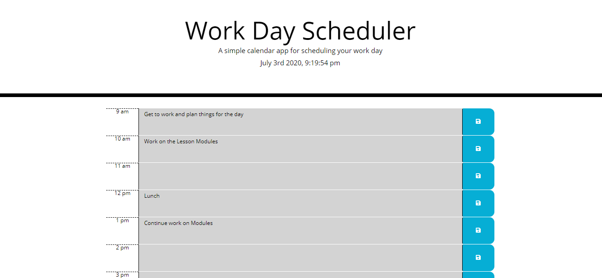

# mod5challenge
Creating a daily planner application using jQuery, Bootstrap, and Moment.js

## Description: 
This project is a "Work Day Scheduler" that a person can use to track their tasks during standard working hours, from 9am to 5pm. At the top of the page the current date and time is displayed and updated as a clock. The bottom section of the page is divided up into several rows, with each row being an hour from the day. You can type in the blank area in the center to add tasks or important things that need to be tracked throughout the day. Pressing the blue button on the right will save the text entered. Finally, hours that have passed will be colored gray, hours in the future will be colored green, and the current hour will be colored red.

## Screenshot of Webpage

## About the Project:
The main layout and styling of the webpage uses the Bootstrap library to style the page. The time-block section makes use of the grid system that bootstrap enables. The date and time at the top of the page is displayed with Moment.js, and updates every second with a setInterval() function. Most of the script uses jQuery. The save button is selected and given a "click" event listener that takes the value of the textarea and places it into localStorage so that it persists when the page is reloaded. The tasks are loaded by using jQuery to assign the value of the text area to whatever was retrieved from localStorage. Finally, the $(.time-block).each(function()) is a mix of jQuery and Moment.js. jQuery is used to select the ID of the row and convert it to an "hour" of the day. An if statement then checks to see if that hour is less than, greater, or equal to the current hour, and applies the necessary class to it.

## Link to Deployed Application
https://adamkeyser45.github.io/mod5challenge/